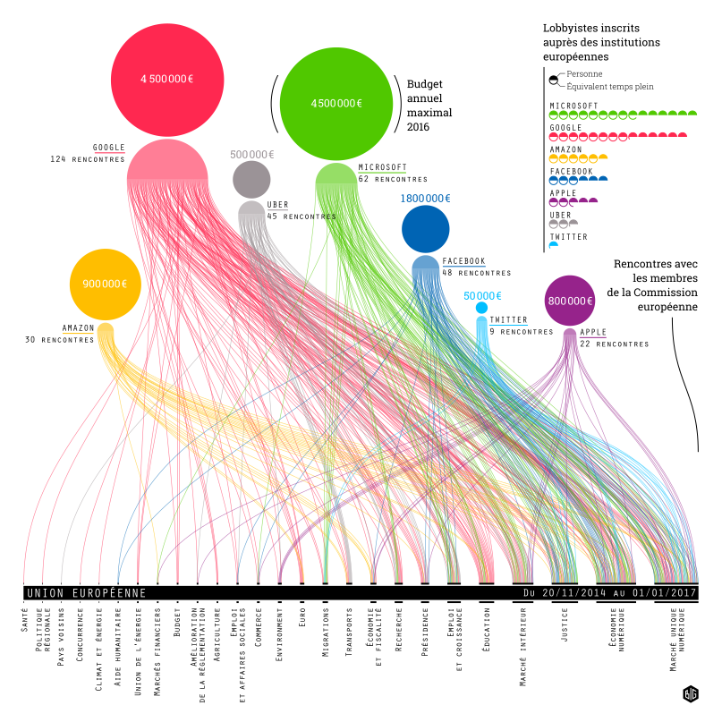
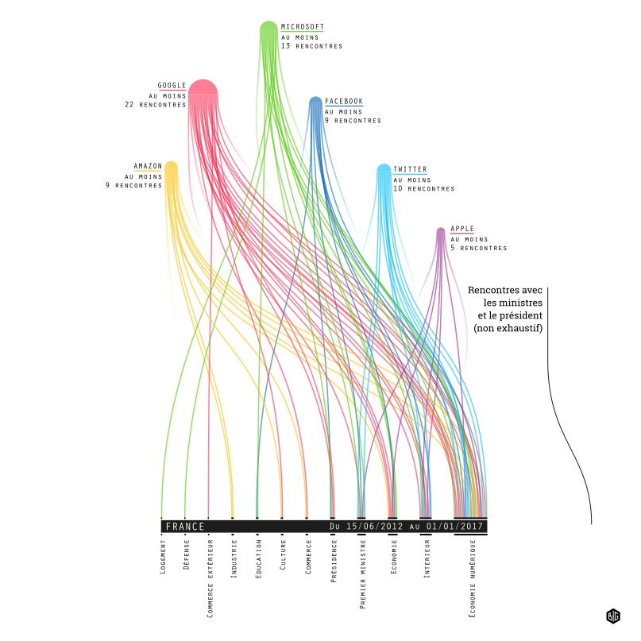

# L'influence tentaculaire des géants américains

Protection des données personnelles, réglementation des VTC, scénarios fiscaux : les législations européennes et françaises peuvent avoir des effets importants sur les géants technologiques américains et leurs profits. Pour s'éviter des déconvenues budgétaires ou préparer la législation à leurs prochaines innovations, ces géants investissent dans le lobbying. Près de 13 millions d'euros [sont dépensés en lobbying par Google, Microsoft, Facebok, Apple, Amazon, Twitter et Uber](./lobbies.csv). 

Les lois concernant le lobbying sont quasiment inexistantes en France. Personne ne répertorie les rencontres entre ceux qui écrivent les lois et les lobbyistes. Parcellairement, on peut reconstituer [quelques rencontres entre le pouvoir exécutif et les géants américains](./rencontres-france.csv). Les rencontres les plus médiatisés sont celles qui donnent un visage souriant à des heures de lobbying. La signature d'un contrat entre le ministère de l'Éducation nationale et Microsoft en xxx. La 

